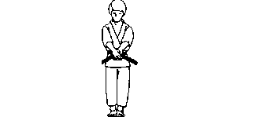

[Kata](https://en.wikipedia.org/wiki/Kata) & [Code Kata](http://codekata.com/)

>When an artist begins a sculpture he or she doesn’t start with the eye and finish and perfect the eye before moving to another part of the sculpture. No, the artist begins with an outline of the entire piece and slowly chips away revealing the sculpture that lies within the stone.

>So it should be with kata. You can learn and get a rough idea of the entire kata in movements, and then begin to tweak and perfect each movement, revealing the art that lies within the kata.

>Above quotes from: [kata-vs-kumite](http://the-martial-way.com/kata-vs-kumite/)
