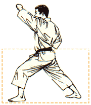
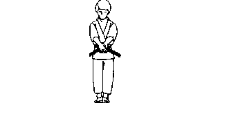

### Simplify Learning 
 
 

An anthology of programs to simplify understanding of foundational algorithms and basic frameworks. Written in Java, built with Gradle goodness:
* [List of Algorithms](algorithms/ALGORITHMS.md)
* [Spring Boot 101](sample-rest-service/SERVICE.md)

#### Stages of Learning
|Stage|Visual|Description|
|-----|------|-----------|
|[Kihon](https://en.wikipedia.org/wiki/Kihon)||The basic algorithmic concepts and fundamental techniques.|
|[Kata](https://en.wikipedia.org/wiki/Kata)||Assert the learnings with rigorous practice and achieve 1+ level of proficiency.|
|[Kumite](https://en.wikipedia.org/wiki/Kumite)||The assembling of basic moves into coherent sequences, leading to something that solves a real-life problem.|

> One becomes a beginner after one thousand days of training and an expert after ten thousand days of practice.

> When an artist begins a sculpture he or she doesn’t start with the eye and finish and perfect the eye before moving to another part of the sculpture. No, the artist begins with an outline of the entire piece and slowly chips away revealing the sculpture that lies within the stone.

> So it should be with kata. You can learn and get a rough idea of the entire kata in movements, and then begin to tweak and perfect each movement, revealing the art that lies within the kata.

#### Dev Help
0. Build: `./gradlew clean build`
1. Please import [Google style-guide](https://github.com/google/styleguide) into your IDE, to prevent code-style violations.
2. To publish from localhost to coveralls cloud, set the COVERALLS_REPO_TOKEN environment variable.
3. To update/refresh the javadocs, run `./gradlew alljavadoc` and re-commit the docs/ folder.

#### How to contribute ?
Please create a new branch from 'master' and raise a pull-request once ready for review.
* [Code of Conduct](https://www.contributor-covenant.org/version/1/4/code-of-conduct/)
* [Copyright License](LICENSE)
